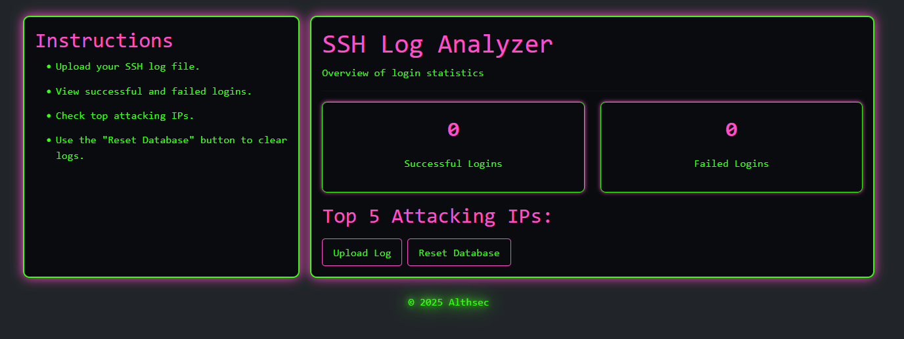
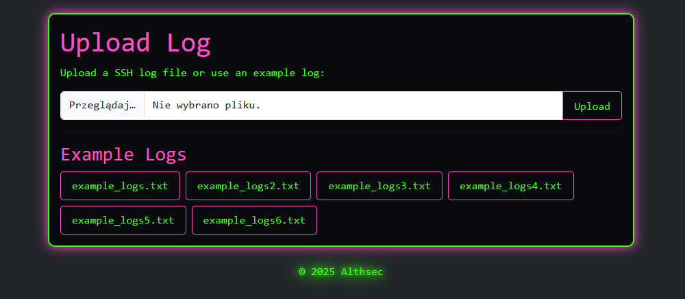
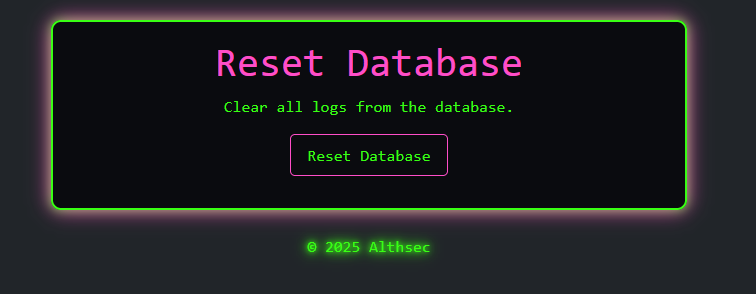

# SSH Log Analyzer

## Project Description
SSH Log Analyzer is a Python web application developed as a final project for the CS50 course. The tool parses server log files (e.g., SSH), counts failed and successful login attempts, and identifies the top attacking IP addresses. The web interface allows easy upload of logs, viewing statistics, and resetting the database.

## Features
* Parse SSH log files and extract key information.
* Count total failed login attempts.
* Count total successful logins.
* Display top 5 attacking IP addresses by number of failed logins.
* Upload your own log files or use example logs.
* Reset the database to clear all logs with one click.
* Responsive dark-themed interface using Bootstrap.

## Installation
1.  **Clone the repository:**
```bash
git clone https://github.com/Althse/LogAnalyzer
```
2.  **Navigate to the project folder:**
```bash
cd LogAnalyzer
```
3.  **Create and activate a virtual environment:**
```bash
python3 -m venv venv
source venv/bin/activate  # macOS/Linux
# or: venv\Scripts\activate  # Windows
```
4.  **Install dependencies:**
```bash
pip install -r requirements.txt
```
5. **(Optional) Add example logs:**
```bash
mkdir example_logs
```

## Usage
1. **Run the web application**
```bash
python app.py
```
2. **Open your browser and go to:**
```bash
http://127.0.0.1:5000/
```

## Pages Overview
* Home Page: Displays statistics for successful and failed logins and top attacking IPs.
* Upload Page: Upload your own log files or select an example log.
* Reset Database Page: Clear all logs from the database.

## Screenshots

### Home Page


### Upload Page


### Reset Database Page


## Example Output
* After uploading a log file, the home page displays a summary:
```bash
Successful Logins: 2
Failed Login Attempts: 3

Top 5 Attacking IPs:
 - 203.0.113.1: 3 attempts
 - 198.51.100.2: 2 attempts
```

## Author
* Sławomir Cieślik
* **LinkedIn:** https://www.linkedin.com/in/s%C5%82awomir-cie%C5%9Blik-646bb6bb/
* **GitHub:** https://github.com/Althse


